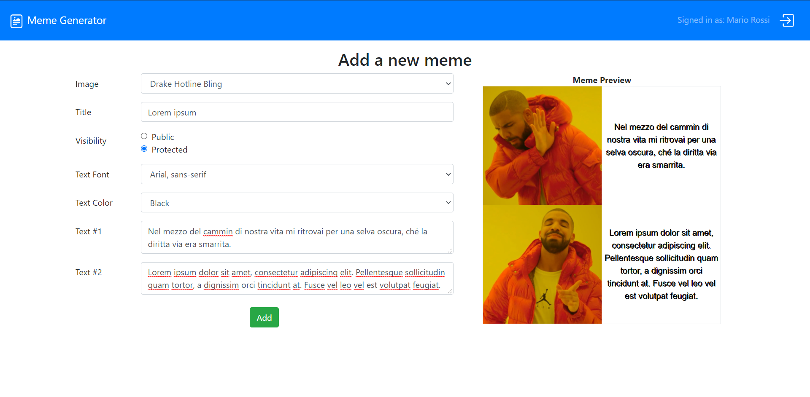

# Exam #2: "Generatore meme"

## Student: s287584 D'ANDREA GIUSEPPE

## React Client Application Routes

- Route `/login`: route to perform login
- Route `/add`: route to add a new meme, accessible only by an authenticated user
- Route `/`: default route to list all memes (authenticated user) or only public memes (unauthenticated user)

## API Server

### **Login**

URL: `/api/v1/sessions`

Method: POST

Description: Perform the login.

Request body: An object representing the user credentials (Content-Type: `application/json`).

```json
{
  "username": "mario.rossi@example.com",
  "password": "NTanTriN"
}
```

Response: `200 OK` (success), `401 Unauthorized` (wrong credentials) or `500 Internal Server Error` (internal database error).

Response body: An object representing the user (Content-Type: `application/json`).

```json
{
  "id": 1,
  "username": "mario.rossi@example.com",
  "name": "Mario Rossi"
}
```

### **Logout**

URL: `/api/v1/sessions/current`

Method: DELETE

Description: Perform the logout.

Request body: *None*

Response: `204 No Content` (success).

Response body: *None*

### **Get current User**

URL: `/api/v1/sessions/current`

Method: GET

Description: If the user is logged in, retrieve the current user.

Request body: *None*

Response: `200 OK` (success) or `401 Unauthorized` (unauthenticated user).

Response body: An object representing the user (Content-Type: `application/json`).

```json
{
  "id": 1,
  "username": "mario.rossi@example.com",
  "name": "Mario Rossi"
}
```

### **List Fonts**

URL: `/api/v1/fonts`

Method: GET

Description: Retrieve the list of all the available fonts.

Request body: *None*

Response: `200 OK` (success), `401 Unauthorized` (unauthenticated user) or `500 Internal Server Error` (internal database error).

Response body: An array of objects, each describing a font.

```json
[
  {
    "id": 1,
    "fontFamily": "Arial, sans-serif",
    "fontSize": "1em"
  },
  {
    "id": 2,
    "fontFamily": "'Times New Roman', serif",
    "fontSize": "1em"
  },
  ...
]
```

### **Get a Font (by id)**

URL: `/api/v1/fonts/<id>`

Method: GET

Description: Get the font identified by the id `<id>`.

Request body: _None_

Response: `200 OK` (success), `401 Unauthorized` (unauthenticated user), `404 Not Found` (wrong id) or `500 Internal Server Error` (internal database error).

Response body: An object, describing a single font.

```json
{
  "id": 1,
  "fontFamily": "Arial, sans-serif",
  "fontSize": "1.25em"
}
```

### **List Colors**

URL: `/api/v1/colors`

Method: GET

Description: Retrieve the list of all the available colors.

Request body: *None*

Response: `200 OK` (success), `401 Unauthorized` (unauthenticated user) or `500 Internal Server Error` (internal database error).

Response body: An array of objects, each describing a color.

```json
[
  {
    "id": 1,
    "name": "White",
    "colorHex": "#FFFFFF"
  },
  {
    "id": 2,
    "name": "Black",
    "colorHex": "#000000"
  },
  ...
]
```

### **Get a Color (by id)**

URL: `/api/v1/colors/<id>`

Method: GET

Description: Get the color identified by the id `<id>`.

Request body: _None_

Response: `200 OK` (success), `401 Unauthorized` (unauthenticated user), `404 Not Found` (wrong id) or `500 Internal Server Error` (internal database error).

Response body: An object, describing a single color.

```json
{
  "id": 1,
  "name": "White",
  "colorHex": "#FFFFFF"
}
```

### **List Templates**

URL: `/api/v1/templates`

Method: GET

Description: Retrieve the list of all the available templates.

Request body: *None*

Response: `200 OK` (success), `401 Unauthorized` (unauthenticated user) or `500 Internal Server Error` (internal database error).

Response body: An array of objects, each describing a template.

```json
[
  {
    "id": 1,
    "name": "Change My Mind",
    "imagePath": "/images/templates/Change-My-Mind.jpg",
    "width": 482,
    "height": 361,
    "textArea1": "220;220;200;70",
    "textArea2": null,
    "textArea3": null
  },
  {
    "id": 2,
    "name": "Disaster Girl",
    "imagePath": "/images/templates/Disaster-Girl.jpg",
    "width": 500,
    "height": 375,
    "textArea1": "10;10;480;90",
    "textArea2": null,
    "textArea3": null
  },
  ...
]
```

### **Get a Template (by id)**

URL: `/api/v1/templates/<id>`

Method: GET

Description: Get the template identified by the id `<id>`.

Request body: _None_

Response: `200 OK` (success), `401 Unauthorized` (unauthenticated user), `404 Not Found` (wrong id) or `500 Internal Server Error` (internal database error).

Response body: An object, describing a single template.

```json
{
  "id": 1,
  "name": "Change My Mind",
  "imagePath": "/images/templates/Change-My-Mind.jpg",
  "width": 482,
  "height": 361,
  "textArea1": "220;220;200;70",
  "textArea2": null,
  "textArea3": null
}
```

### **List Memes**

URL: `/api/v1/memes`

Method: GET

Description: Retrieve the list of all memes (if user is authenticated) or only public memes (if user is not unauthenticated).

Request body: *None*

Response: `200 OK` (success) or `500 Internal Server Error` (internal database error).

Response body: An array of objects, each describing a meme.

```json
[
  {
    "id": 1,
    "templateId": 1,
    "userId": 1,
    "title": "Meme1",
    "isPublic": 1,
    "fontId": 1,
    "colorId": 2,
    "text1": "Text1",
    "text2": null,
    "text3": null,
    "userName": "Mario Rossi"
  },
  {
    "id": 2,
    "templateId": 4,
    "userId": 2,
    "title": "Meme2",
    "isPublic": 0,
    "fontId": 3,
    "colorId": 1,
    "text1": "Text1",
    "text2": "Text2",
    "text3": null,
    "userName": "Paolo Russo"
  },
  ...
]
```

### **Get a Meme (by id)**

URL: `/api/v1/memes/<id>`

Method: GET

Description: Get the a public meme or a protected meme (only if user is authenaticated) identified by the id `<id>`.

Request body: _None_

Response: `200 OK` (success), `401 Unauthorized` (unauthenticated user), `404 Not Found` (wrong id) or `500 Internal Server Error` (internal database error).

Response body: An object, describing a single meme.

```json
{
  "id": 1,
  "templateId": 1,
  "userId": 1,
  "title": "Meme1",
  "isPublic": 1,
  "fontId": 1,
  "colorId": 2,
  "text1": "Text1",
  "text2": null,
  "text3": null,
  "userName": "Mario Rossi"
}
```

### **Add a new Meme**

URL: `/api/v1/memes`

Method: POST

Description: If user is authenticated, add a new meme.

Request body: An object representing a meme (Content-Type: `application/json`).

```json
{
  "templateId": 1,
  "title": "Meme3",
  "isPublic": true,
  "fontId": 3,
  "colorId": 4,
  "text1": "Text1",
  "text2": null,
  "text3": null,
}
```

Response: `201 Created` (success), `401 Unauthorized` (unauthenticated user) or `500 Internal Server Error` (internal database error). If the request body is not valid, `422 Unprocessable Entity` (validation error).

Response body: The last id assigned to the meme.

```json
{
  "lastId": 3
}
```

### **Delete an existing Meme**

URL: `/api/v1/memes/<id>`

Method: DELETE

Description: If user is authenticated, delete an existing meme, identified by the id `<id>`.

Request body: *None*

Response: `200 OK` (success), `401 Unauthorized` (unauthenticated user), `404 Not Found` (wrong id) or `500 Internal Server Error` (internal database error).

Response body: The number of changes in the memes list (1 if the meme was successfully deleted, 0 if not).

```json
{
  "changes": 1
}
```

## Database Tables

- Table `fonts` - contains list of fonts
  - `id`
  - `fontFamily`
  - `fontSize`
- Table `colors` - contains list of colors
  - `id`
  - `name`
  - `colorHex`
- Table `templates` - contains list of templates (predefined background images)
  - `id`
  - `name`
  - `imagePath`
  - `width`
  - `height`
  - `textArea1`: (x; y; width; height) format
  - `textArea2`: (x, y, width, height) format
  - `textArea3`: (x, y, width, height) format
- Table `memes` - contains list of memes created by creators
  - `id`
  - `templateId`
  - `userId`
  - `title`
  - `isPublic`
  - `fontId`
  - `colorId`
  - `text1`
  - `text2`
  - `text3`
- Table `users` - contains list of users (creators)
  - `id`
  - `name`
  - `username`
  - `passwordHash`

## Main React Components

- `NavBar` (in `NavBar.js`): top navigation bar
- `LoginForm` (in `LoginForm.js`): form to perfom the login
- `MemesList` (in `MemesList.js`): list of memes
- `MemeForm` (in `MemeForm.js`): form to add a new meme
- `MemePreview` (in `MemePreview.js`): provide a preview (visualize the backgroud image with the text overlaid in the predefined positions) of a meme

## Screenshot



## Users Credentials

| Username                       | Password  | Info  |
|------------------------------- |---------- |------ |
| mario.rossi@example.com        | NTanTriN  | Created memes: "Meme1", "Meme4" and "Meme7" (copied from "Meme6") |
| paolo.russo@example.com        | iRCEnThe  | Created memes: "Meme2", "Meme5" and "Meme8" (copied from "Meme3") |
| francesco.colombo@example.com  | gnaLaRcu  | Created memes: "Meme3", "Meme6" and "Meme9" (copied from "Meme5") |
